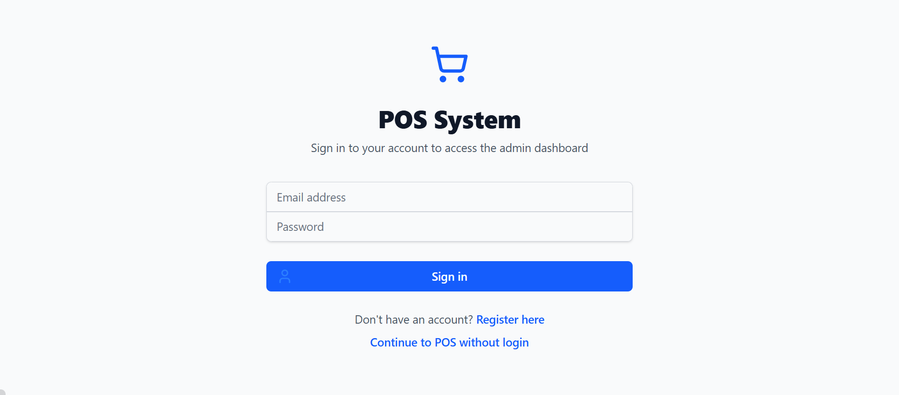
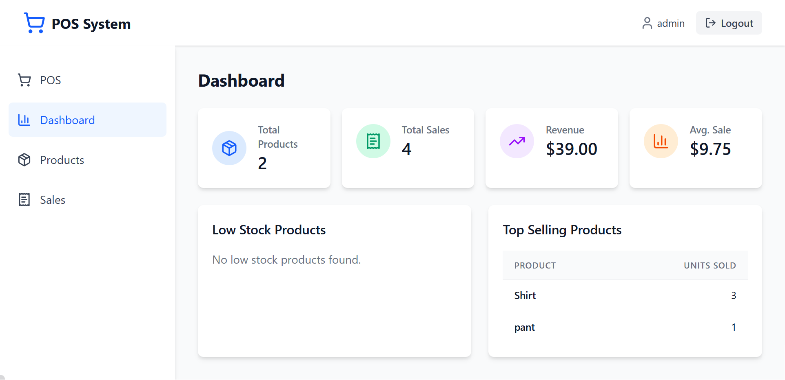
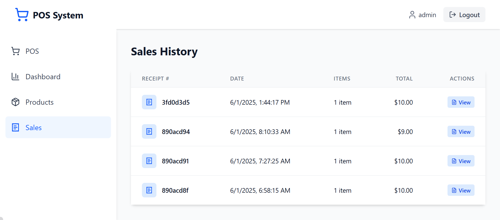

# 🧾 Full-Stack POS System

A complete full-stack Point of Sale (POS) system built with:

- ⚛️ **Frontend**: React.js + Vite
- 🚀 **Backend**: NestJS (Node.js)
- 🍃 **Database**: MongoDB
- 📦 **Package Manager**: pnpm
- 🔌 **API**: REST API

---

## 🌐 URLs

- **Frontend**: [http://localhost:5173](http://localhost:5173)
- **Backend API**: [http://localhost:8000](http://localhost:8000)

---

## 📁 Project Structure

```
project-root/
│
├── frontend/     → React + Vite frontend
├── backend/      → NestJS backend (REST API)
└── README.md     → Project instructions and docs
```

---

## ⚙️ Prerequisites

Ensure you have the following installed:

- [Node.js](https://nodejs.org/) (v18+)
- [pnpm](https://pnpm.io/) (v8+)
- [MongoDB](https://www.mongodb.com/try/download/community) or MongoDB Atlas
- [Postman](https://www.postman.com/) or similar tool for API testing (optional)

---

## 🚀 Setup Instructions

### 1. Clone the Repository

```bash
git clone <your-repo-url>
cd project-root
```

---

### 2. Install Dependencies

Using pnpm:

```bash
# Frontend
cd frontend
pnpm install

# Backend
cd ../backend
pnpm install
```

---

### 3. Environment Variables

Create a `.env` file inside the `backend/` folder:

```env
PORT=8000
MONGODB_URI=mongodb://localhost:27017/pos_db
JWT_SECRET=your_jwt_secret
```

> ✅ Replace values as needed. For MongoDB Atlas, use your connection string.

---

### 4. Run Development Servers

#### Backend (NestJS)

```bash
cd backend
pnpm run start:dev
```

> Server runs on: `http://localhost:8000`

### 3. Environment Variables

Create a `.env` file inside the `backend/` folder:

```env
PORT=8000
MONGODB_URI=mongodb://localhost:27017/pos_db
JWT_SECRET=your_jwt_secret
```

> ✅ Replace values as needed. For MongoDB Atlas, use your connection string.

---

#### Frontend (React + Vite)

```bash
cd frontend
pnpm run dev
```

> App runs on: `http://localhost:5173`

---

## 📡 API Documentation

### 🔐 Authentication

| Method | Endpoint         | Description           |
| ------ | ---------------- | --------------------- |
| POST   | `/auth/register` | Register a new user   |
| POST   | `/auth/login`    | Login and get a token |

### 📦 Products

| Method | Endpoint        | Description            |
| ------ | --------------- | ---------------------- |
| GET    | `/products`     | Get all products       |
| GET    | `/products/:id` | Get product by ID      |
| POST   | `/products`     | Create a new product   |
| PUT    | `/products/:id` | Update an existing one |
| DELETE | `/products/:id` | Delete a product       |

### 🧾 Sales

| Method | Endpoint     | Description       |
| ------ | ------------ | ----------------- |
| GET    | `/sales`     | Get all sales     |
| GET    | `/sales/:id` | Get sale by ID    |
| POST   | `/sales`     | Create a new sale |

> ⚠️ **Secure Routes** require a JWT token in the `Authorization` header:

```
Authorization: Bearer <your_token>
```

---

### 🧪 Sample API Request (with cURL)

```bash
curl -X POST http://localhost:8000/auth/login   -H "Content-Type: application/json"   -d '{"email":"admin@example.com","password":"password123"}'
```

---

## 🖼️ Screenshots

Add screenshots to the `screenshots/` folder and display them here.

| 🔐 Login Page                | 📊 Dashboard                     | 🧾 Sales Page                |
| ---------------------------- | -------------------------------- | ---------------------------- |
|  |  |  |

---

## 📦 Build for Production

### Frontend

```bash
cd frontend
pnpm run build
```

> Output in `frontend/dist/`

### Backend

```bash
cd backend
pnpm run build
```

> Compiled files in `backend/dist/`

---

## 🐳 Docker Setup (Optional)

Want containerized deployment?

Ask to add:

- `Dockerfile` for frontend & backend
- `docker-compose.yml` for the full stack

---

## 🧪 Testing

Use Postman, Insomnia, or browser DevTools to test your REST API at:

- `http://localhost:8000/auth`
- `http://localhost:8000/products`
- `http://localhost:8000/sales`

---

## 📄 License

MIT License © [Your Name]

---

## 🙋‍♂️ Author

- GitHub: [@yourusername](https://github.com/yourusername)
- Email: you@example.com

---

## ✅ To Do / Enhancements

- [ ] Add role-based access (admin/cashier)
- [ ] Add Swagger API Docs (`@nestjs/swagger`)
- [ ] Add Docker support
- [ ] Deploy backend (e.g. Railway, Render)
- [ ] Deploy frontend (e.g. Vercel, Netlify)
